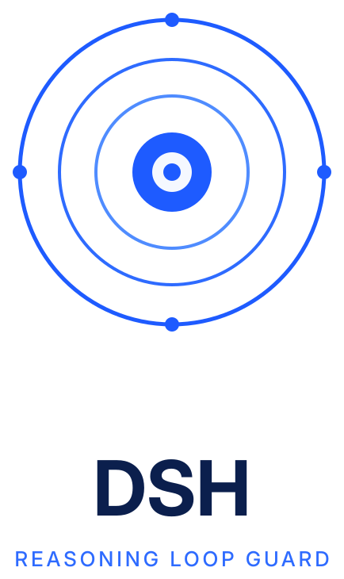

# dsh-reasoning-loop-guard

<p align="center">
  <picture>
    <source media="(prefers-color-scheme: dark)" srcset="assets/logo-dark.svg">
    
  </picture>
</p>

[](#测试)
[](LICENSE)

**简体中文** | [English](README.en.md)

> **AI 使用说明** —— 本项目由 AI 助手协助整理撰写：源码、测试、文档与提交信息均由 AI 智能体（DSH Agent，运行于 DeepSeek Harness）在人类指导下起草；需求定义、方案决策与最终验收由人类作者完成。

检测并提前中断 [DSH](https://github.com/deepseek-ai/deepseek-harness) 中的**推理复读**——也就是「思维链循环卡死」：模型其实已经想完了，却卡在「准备输出」上无限打转，白烧掉几分钟和几十万字符，直到用户放弃并按下停止。

它把「静默卡死好几分钟」变成「立刻可见的报错」。

## 它解决的问题

在一次被完整记录的会话里（12 轮、324 步），**12 轮中有 11 轮**以完全相同的方式结束：

- 模型**早已做完真正的工程工作**——看截图、算坐标、决定改哪个脚本。
- 然后它卡在「准备输出」阶段，反复催促自己却始终不落笔：
  `Let me write. Go. OK. Emit. Now.` / `Writing. OK. Let me write. Go.`
- 单步输出了 **240,000–280,000 字符**，耗时 **208 秒**，直到用户按下停止才结束。

这 11 条 assistant 消息的 `stopReason` 都是**空字符串**，内容只有**一个 `reasoning` 块**——没有 `text`，也没有 `tool-call`。模型没有产出任何一个可执行动作，它只是在自己的思考里空转。

而 DSH 当时没有任何护栏能发现这一点并提前叫停。

## 工作原理

插件挂载在 `llm/stream` 瀑布钩子上——正是 DSH 自己的 `llm-invariant` 校验所用的同一个扩展点——只测量流式推理文本，并在判定成立的瞬间**停止向上游拉取**，随后发出终止块：

```js
{ type: "finish", reason: { kind: "error", failure: { message, code: "REASONING_LOOP" } } }
```

DSH 随后走它既有的 provider 错误路径处理：本步以一个可见错误结束，而不是静默空转。

每 `every` 个字符，在滚动缓冲区上评估两条判据：

| 判据 | 定义 | 实测（11 个正样本 / 166 个负样本） | 阈值 |
| --- | --- | --- | --- |
| `periodic-run`（主判据） | 缓冲区尾部存在 ≥ `minUnits` 个**连续相同的单元**，周期 p ∈ [8, 400] | 正样本 **5..50** 个单元，负样本 **0..2** | 4 |
| `kgram-repeat`（次判据） | 末尾 `kgram` 个字符在窗口内出现 ≥ `kgramThreshold` 次 | 正样本 **20..162**，负样本 **1..5** | 12 |

以周期判据为主，是因为它对两个样本群的分离度远高于 k-gram 判据；k-gram 判据则用于兜住周期落在 `[minPeriod, maxPeriod]` 之外的复读。

在六种喂入粒度下（chunk = 1 / 8 / 40 / 200 / 1000 / 4000），两条判据均为 **11/11 全部命中、0/166 零误报**。

**只测量 `reasoning-delta`，绝不测量 `block-end`**——后者会重放整个块的文本，等于人为制造出它正要寻找的那种重复。**也绝不测量 `text-delta`**：正常的长输出（表格、代码）本来就可能重复，漏报好过误杀。

## 安装

本包尚未发布到 npm，从 GitHub 源码安装：

```powershell
# 在你的 DSH profile 目录下执行（例如 ~/.dsh/profiles/desktop）
npm install github:himi-li/dsh-reasoning-loop-guard
```

然后在 profile 的 `package.json` 里注册 bundle：

```json
{
  "dsh": {
    "profile": {
      "bundles": ["@deepseek-ai/dsh-base", "...", "dsh-reasoning-loop-guard"]
    }
  }
}
```

或者直接在 profile 的 `cordis.patch.yml` 里挂载（本包自带的就是这一份）：

```yaml
- insert:
    - id: reasoning-loop-guard
      name: dsh-reasoning-loop-guard
      config: {}
```

补丁会热重载，无需重启 DSH。

## 配置

所有字段都可以在 profile 的 `cordis.patch.yml` 里覆盖：

```yaml
- insert:
    - id: reasoning-loop-guard
      name: dsh-reasoning-loop-guard
      config:
        enabled: true
        minUnits: 4                # periodic-run：连续重复单元数
        kgramThreshold: 12         # kgram-repeat：尾部 k-gram 的出现次数
        minChars: 1500             # 低于这么多字符不做判定
        every: 200                 # 每 N 个字符评估一次
        failureCode: REASONING_LOOP

        # 触发日志（见下）
        journal: true
        journalPath: ""            # 默认：$DSH_HOME/dsh-reasoning-loop-guard/fires.jsonl
        journalMaxBytes: 524288
        journalPreviewChars: 120
        logTool: true              # 注册 reasoning_loop_log 工具
```

| 字段 | 默认值 | 含义 |
| --- | --- | --- |
| `enabled` | `true` | 总开关。为 false 时插件完全不注册任何流钩子。 |
| `minChars` | `1500` | 短于此长度的推理永不判定。 |
| `every` | `200` | 判定节奏，单位为字符。 |
| `window` | `4096` | k-gram 判据使用的滚动窗口。 |
| `kgram` | `64` | k-gram 判据跟踪的尾部片段长度。 |
| `kgramThreshold` | `12` | 在 `window` 内出现多少次才触发。 |
| `periodTail` | `1200` | 周期判据使用的滚动窗口。 |
| `minPeriod` / `maxPeriod` | `8` / `400` | 周期判据搜索的周期范围。 |
| `minUnits` | `4` | 触发所需的连续相同单元数。 |
| `failureCode` | `REASONING_LOOP` | 终止块携带的失败码。 |
| `journal` | `true` | 把每次触发记录进 JSONL 日志。 |
| `journalPath` | `""` | 日志位置；留空表示 `$DSH_HOME` 下的默认路径。 |
| `journalMaxBytes` | `524288` | 日志超过该字节数后轮转为 `<path>.1`。 |
| `journalPreviewChars` | `120` | 每条记录保存的「肇事尾巴」字符数。 |
| `logTool` | `true` | 注册 `reasoning_loop_log` 工具。 |

`validateConfig()` 会拒绝那些**会静默失效**的配置——`kgram > window`、`minPeriod >= maxPeriod`、`periodTail < 2 * maxPeriod`、`failureCode` 为空、`every` 非正数等等——并在报错信息里点名字段。

## 触发日志与 `reasoning_loop_log` 工具

护栏每触发一次，就向 `$DSH_HOME/dsh-reasoning-loop-guard/fires.jsonl` 追加一行 JSON：

```json
{"v":1,"at":1760000000000,"iso":"2026-10-06T15:20:00.000Z","rule":"periodic-run",
 "atChars":3120,"failureCode":"REASONING_LOOP","pluginVersion":"0.1.0",
 "sessionId":"...","provider":"...","model":"...","units":6,"period":64,
 "preview":"Let me write. Go. OK. Emit. Now. …"}
```

日志是有界的（`journalMaxBytes`，默认 512 KiB → 轮转为 `fires.jsonl.1`），每次写入都包在 try/catch 里，日志故障**只会告警，绝不影响流**。设为 `journal: false` 可整体关闭。

插件还会注册一个只读的维护工具 `reasoning_loop_log`：

| `action` | 返回 |
| --- | --- |
| `list`（默认） | 最近的触发记录，最新在前。可按 `rule`、`sessionId`、`since`（epoch 毫秒）过滤，用 `limit` 限制条数。 |
| `stats` | 汇总：总数、按判据、按模型、按天，以及最早/最晚时间戳。 |
| `path` | 解析后的日志路径。 |
| `clear` | 删除日志（连同轮转出的 `.1`）。 |

于是「最近到底有没有在触发、是在哪个模型上触发的？」只需一次工具调用，而不用去会话日志里翻。

## 关键设计决策

**`failureCode` 故意放在默认可重试集合之外。** 可重试的失败码是 `EMPTY_RESPONSE / RATE_LIMIT / SERVER / TIMEOUT / TRANSPORT`，`REASONING_LOOP` 不在其中，因此 `dsh-llm-retry` 不会自动重试。原因是：复读是**这次请求本身**的性质，自动重试会把整个 prompt 再发一遍，白烧同样的 token 再复读一次。如果你确实想要重试，把 `failureCode` 设为 `EMPTY_RESPONSE`。

**每条流都新建一个检测器。** 自动重试会从零开始计数，上一次尝试的重复不会累积到下一次。

**对工具服务没有硬依赖。** 工具是通过 `ctx.inject(["tools"], …)` 注册的——一种**可选**注入。若写成硬 `inject`，那么在任何没有 tools 服务的宿主上插件都会变成 inactive，等于为了一个诊断功能而把护栏本身也关掉了。

**零运行时依赖。** 除了声明为 peer 的 DSH 宿主包之外，插件不导入任何东西。

## 测试

```powershell
npm test
```

四套测试，必须全部通过：

| 套件 | 覆盖内容 |
| --- | --- |
| [`test/test-guard.mjs`](test/test-guard.mjs) | 六种 chunk 大小下的检测器定标、分离度、`guardStream` 协议一致性（恰好一个终止 `finish`、提前停止、已中止信号的处理、健康流不被改动）、消息渲染。 |
| [`test/test-journal.mjs`](test/test-journal.mjs) | `$DSH_HOME` 解析、preview 截断、记录形状、解析容错、过滤、`stats` 聚合、轮转，以及「日志故障永不抛异常」这条保证。 |
| [`test/smoke/smoke.mjs`](test/smoke/smoke.mjs) | 用桩宿主驱动真实的 `apply()`：配置校验、全局只注册一个 `llm/stream` 监听器、工具注册，以及该工具的端到端行为。 |
| [`test/smoke/real-protocol.mjs`](test/smoke/real-protocol.mjs) | 真实的 `@deepseek-ai/dsh-llm` 不变量校验门，断言护栏的输出是一条**合法**的流。 |

两个 smoke 套件通过 [`test/smoke/resolve-hook.mjs`](test/smoke/resolve-hook.mjs) 把 `@deepseek-ai/*` 解析到 app 与 profile 的安装位置，因此不必启动 DSH 就能验证宿主侧的那一半。

### 端到端验证记录

开发期间，护栏还额外用**真实的 `dsh` CLI 驱动一个真实的 agent loop**做过端到端验证，跑在一个隔离 profile 上，该 profile 的默认模型是一个只用于测试的适配器，回放一段退化推理流。这里没有任何东西是仿制品：不是 loop，不是瀑布钩子，不是不变量校验门，也不是 CLI 的错误出口。

两臂、十一项断言：

| | 护栏开启 | 护栏关闭（同一条流） |
| --- | --- | --- |
| 退出码 | **1** | **0** |
| 上游实际发出 | **3120 / 7659 字符** | 7659 / 7659 字符 |
| 上游是否跑到自己的结尾 | 否 | 是 |
| stderr | `REASONING_LOOP: … 周期 64 字符，重复 6 次，已读到 3120 字符` | — |
| stdout | 空 | `TG-FAKE-OK` |

也就是说：护栏**确实把上游生成器截断了**（而不是等流跑完才报个错）；而关掉护栏后，同一条流完整跑完、毫发无损——这排除了「测试装置本身是坏的」这种可能。

> 这套端到端装置属于开发脚手架，不随包发布。上面四套测试才是随包交付的。

## 测试夹具

护栏的阈值是针对一次真实故障定标的，但那段会话的推理文本属于隐私，因此仓库里提交的 [`test/fixtures/`](test/fixtures/) 夹具是**合成的**。它们复现了原始数据**实测出来的形状**——相同的行数（11 / 166）、相同的逐行字符数（从一条 24.4 万字符的大块，到 502 字符的小块），以及相同的复读几何（单元周期经过挑选，使 k-gram 判据计得 20..162 次命中、周期判据计得 5..50 个单元）。

生成器带随机种子且完全确定，因此重新生成会产出逐字节相同的文件，任何 diff 都是真实变更。

## 已知边界

- **它不是通用看门狗。** 这两条判据针对的是一种特定的退化形态——尾部连续重复。换一种卡法（比如无限工具调用循环，或者模型在语义上绕圈但并不逐字重复）不会触发它。
- **首次触发的位置**取决于喂入粒度：最早约 3000 字符，最晚约 56000 字符。记录在案的 11 次故障都会在 10,000 字符以内被拦住。
- **定标样本是单个会话的 177 条。** 样本量偏小。若实践中出现误报，请优先调高 `minUnits` / `kgramThreshold`。
- 插件只缓解症状。如果你的 provider 支持更低的推理档位，那才是针对病因，可以与这个护栏一起用。

## 许可证

[MIT](LICENSE)
